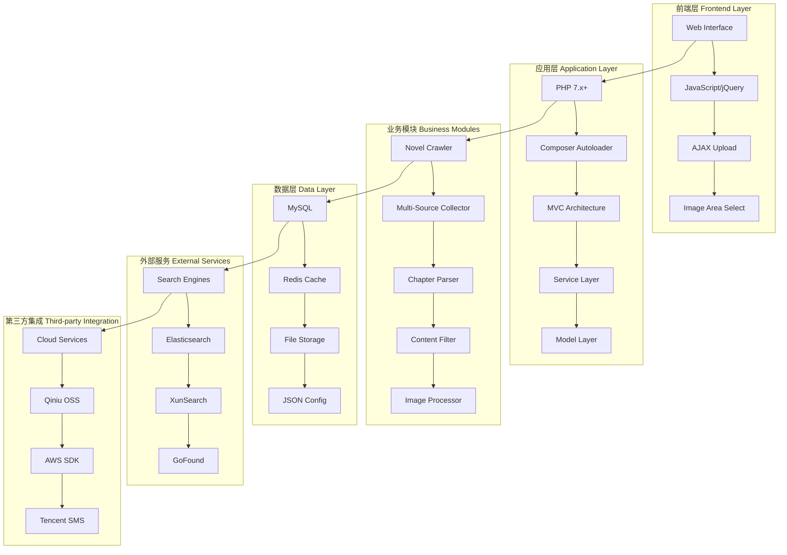
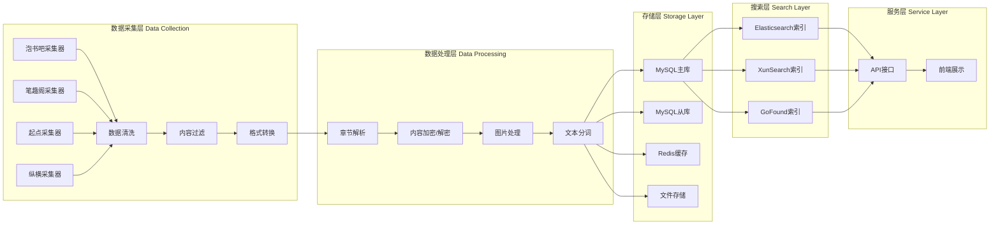
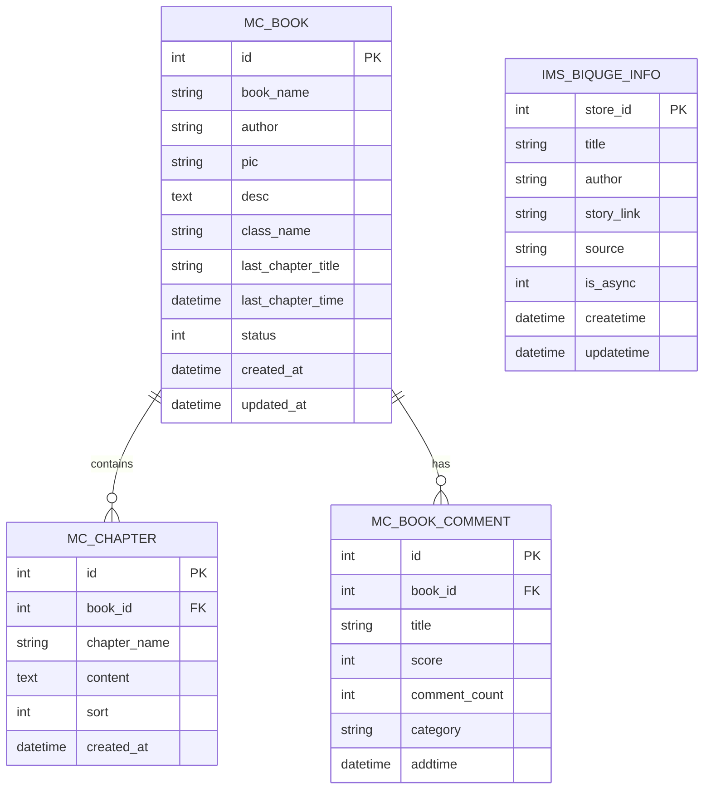
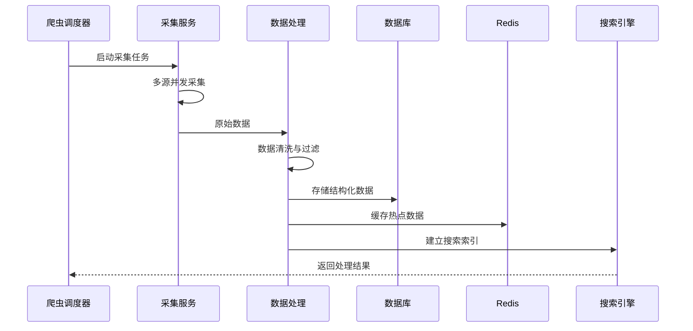
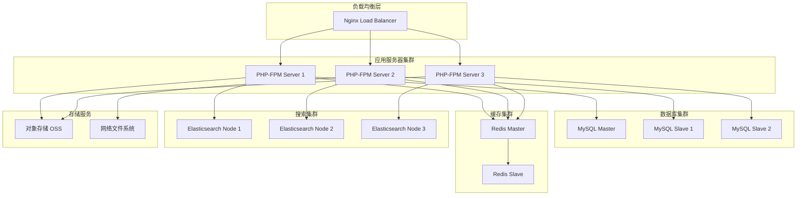
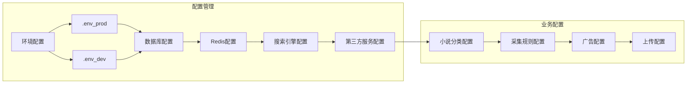
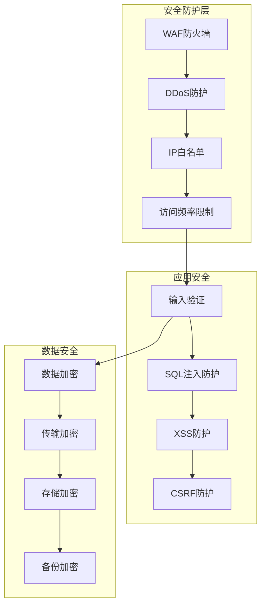

# NEOVEL Data - 小说采集系统技术架构

## 🏗️ 系统架构概览



## 🔧 技术栈详细分析

### 核心技术栈

#### 1. 后端框架与语言
```yaml
语言: PHP 7.x+
架构模式: MVC + Service Layer
依赖管理: Composer
自动加载: PSR-4
```

#### 2. 数据存储
```yaml
关系数据库: MySQL
缓存系统: Redis
文件存储: 本地文件系统 + 云存储
配置存储: JSON/PHP配置文件
```

#### 3. 搜索引擎
```yaml
全文搜索: 
  - Elasticsearch 7.11+
  - XunSearch (中文搜索)
  - GoFound (自建搜索)
```

#### 4. 网络请求与爬虫
```yaml
HTTP客户端:
  - Guzzle HTTP 7.0+
  - cURL Multi
  - Swoole 协程
  - QueryList (DOM解析)
```

## 📊 系统架构图



## 🗄️ 数据库架构



## 🔄 数据流架构



## 🏭 部署架构



## 📦 核心组件依赖

### Composer 依赖包
```json
{
  "核心框架": {
    "topthink/think-view": "模板引擎",
    "topthink/think-template": "模板系统"
  },
  "数据处理": {
    "elasticsearch/elasticsearch": "搜索引擎",
    "hightman/xunsearch": "中文全文搜索",
    "monolog/monolog": "日志系统"
  },
  "网络请求": {
    "guzzlehttp/guzzle": "HTTP客户端",
    "ares333/php-curl": "cURL封装",
    "yurunsoft/yurun-http": "HTTP工具",
    "jaeger/querylist": "DOM解析",
    "jaeger/curlmulti": "并发请求"
  },
  "文档处理": {
    "mpdf/mpdf": "PDF生成",
    "phpoffice/phpword": "Word文档处理"
  },
  "云服务": {
    "qiniu/php-sdk": "七牛云存储",
    "aws/aws-sdk-php": "AWS服务",
    "tencentcloud/sms": "腾讯云短信"
  },
  "工具库": {
    "overtrue/pinyin": "拼音转换",
    "sqhlib/hanzi-convert": "简繁转换",
    "react/event-loop": "事件循环"
  }
}
```

## 🔧 系统配置架构



## 🚀 性能优化架构

### 1. 缓存策略
```yaml
多级缓存:
  - L1: Redis 内存缓存 (热点数据)
  - L2: 文件缓存 (章节内容)
  - L3: 数据库查询缓存
  - L4: CDN 静态资源缓存
```

### 2. 并发处理
```yaml
并发策略:
  - Swoole 协程 (网络IO)
  - cURL Multi (HTTP并发)
  - 多进程采集 (CPU密集)
  - 队列异步处理 (任务调度)
```

### 3. 数据库优化
```yaml
优化策略:
  - 读写分离
  - 分库分表
  - 索引优化
  - 连接池管理
```

## 🔐 安全架构



## 📈 监控架构

```yaml
监控体系:
  系统监控:
    - CPU/内存使用率
    - 磁盘IO
    - 网络流量
  
  应用监控:
    - 接口响应时间
    - 错误率统计
    - 并发用户数
  
  业务监控:
    - 采集成功率
    - 数据质量
    - 搜索性能
```

这个架构图展示了整个小说采集系统的完整技术栈，包括数据采集、处理、存储、搜索和展示的全流程架构设计。