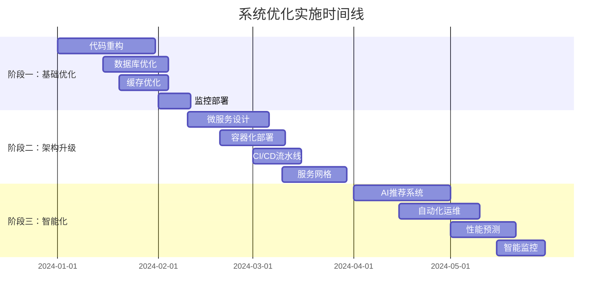

# 实施路线图 - NEOVEL Data 系统优化

## 🗓️ 总体时间规划



## 📋 详细实施计划

### 🎯 阶段一：基础优化 (2个月)

#### Week 1-2: 代码重构
```yaml
目标: 重构核心模块，提升代码质量

任务清单:
  ✅ Day 1-3: 分析现有代码结构
    - 识别代码异味
    - 绘制依赖关系图
    - 制定重构优先级
  
  ✅ Day 4-7: 重构 BiqugeModel 类
    - 拆分为多个服务类
    - 实现依赖注入
    - 添加单元测试
  
  ✅ Day 8-10: 重构数据访问层
    - 创建 Repository 模式
    - 实现查询构建器
    - 添加数据验证
  
  ✅ Day 11-14: 重构网络请求模块
    - 统一 HTTP 客户端
    - 实现重试机制
    - 添加请求监控

交付物:
  - 重构后的核心类
  - 单元测试套件 (覆盖率 > 80%)
  - 代码质量报告
  - 重构文档
```

#### Week 3-4: 数据库优化
```yaml
目标: 优化数据库性能，提升查询效率

任务清单:
  ✅ Day 15-17: 索引优化
    - 分析慢查询日志
    - 创建复合索引
    - 优化查询语句
  
  ✅ Day 18-20: 连接池优化
    - 实现连接池管理
    - 配置读写分离
    - 添加连接监控
  
  ✅ Day 21-24: 分库分表设计
    - 设计分片策略
    - 实现路由逻辑
    - 数据迁移脚本
  
  ✅ Day 25-28: 数据库监控
    - 部署监控工具
    - 配置告警规则
    - 性能基线测试

交付物:
  - 优化后的数据库架构
  - 分库分表实现
  - 监控仪表板
  - 性能测试报告
```

#### Week 5-6: 缓存优化
```yaml
目标: 实现多级缓存，提升系统响应速度

任务清单:
  ✅ Day 29-31: Redis 集群部署
    - 搭建 Redis 主从
    - 配置哨兵模式
    - 实现故障转移
  
  ✅ Day 32-35: 缓存策略设计
    - 设计缓存层次
    - 实现缓存预热
    - 配置过期策略
  
  ✅ Day 36-38: 本地缓存优化
    - 实现内存缓存
    - 配置 LRU 策略
    - 添加缓存监控
  
  ✅ Day 39-42: 缓存一致性
    - 实现缓存更新
    - 处理缓存穿透
    - 解决缓存雪崩

交付物:
  - 多级缓存架构
  - 缓存管理工具
  - 缓存监控系统
  - 性能对比报告
```

#### Week 7-8: 监控与运维
```yaml
目标: 建立完善的监控体系

任务清单:
  ✅ Day 43-45: 应用监控
    - 部署 APM 工具
    - 配置性能指标
    - 设置告警规则
  
  ✅ Day 46-48: 日志系统
    - 统一日志格式
    - 部署日志收集
    - 实现日志分析
  
  ✅ Day 49-52: 健康检查
    - 实现健康检查接口
    - 配置存活探针
    - 设置自动恢复
  
  ✅ Day 53-56: 监控仪表板
    - 创建业务仪表板
    - 配置实时告警
    - 编写运维手册

交付物:
  - 监控系统
  - 告警规则
  - 运维仪表板
  - 故障处理手册
```

### 🚀 阶段二：架构升级 (3个月)

#### Month 3: 微服务架构设计
```yaml
目标: 将单体应用拆分为微服务架构

Week 9-10: 服务拆分设计
  任务:
    - 业务域分析
    - 服务边界划分
    - API 设计
    - 数据一致性方案
  
  交付物:
    - 微服务架构图
    - API 规范文档
    - 数据迁移方案

Week 11-12: 核心服务开发
  任务:
    - 采集服务开发
    - 存储服务开发
    - 搜索服务开发
    - 通知服务开发
  
  交付物:
    - 微服务代码
    - 服务测试套件
    - 部署脚本
```

#### Month 4: 容器化与编排
```yaml
目标: 实现容器化部署和服务编排

Week 13-14: 容器化
  任务:
    - Docker 镜像制作
    - 多阶段构建优化
    - 镜像安全扫描
    - 私有仓库搭建
  
  交付物:
    - Docker 镜像
    - 构建脚本
    - 安全报告

Week 15-16: Kubernetes 部署
  任务:
    - K8s 集群搭建
    - 服务部署配置
    - 负载均衡配置
    - 存储卷管理
  
  交付物:
    - K8s 配置文件
    - 部署文档
    - 运维手册
```

#### Month 5: DevOps 流水线
```yaml
目标: 建立自动化 CI/CD 流水线

Week 17-18: CI/CD 设计
  任务:
    - 流水线设计
    - 自动化测试
    - 代码质量检查
    - 安全扫描集成
  
  交付物:
    - CI/CD 配置
    - 测试报告
    - 质量门禁

Week 19-20: 部署自动化
  任务:
    - 蓝绿部署
    - 金丝雀发布
    - 回滚机制
    - 环境管理
  
  交付物:
    - 部署流水线
    - 发布策略
    - 回滚手册
```

### 🤖 阶段三：智能化优化 (2个月)

#### Month 6: AI 集成
```yaml
目标: 引入人工智能提升系统智能化水平

Week 21-22: 推荐系统
  任务:
    - 用户行为分析
    - 推荐算法实现
    - 模型训练部署
    - A/B 测试框架
  
  交付物:
    - 推荐引擎
    - 模型服务
    - 测试报告

Week 23-24: 智能运维
  任务:
    - 异常检测模型
    - 自动扩缩容
    - 故障预测
    - 自愈机制
  
  交付物:
    - AIOps 平台
    - 预测模型
    - 自动化脚本
```

#### Month 7: 优化与完善
```yaml
目标: 系统整体优化和完善

Week 25-26: 性能调优
  任务:
    - 全链路压测
    - 性能瓶颈分析
    - 系统调优
    - 容量规划
  
  交付物:
    - 性能测试报告
    - 调优方案
    - 容量规划

Week 27-28: 文档与培训
  任务:
    - 技术文档完善
    - 操作手册编写
    - 团队培训
    - 知识转移
  
  交付物:
    - 完整文档体系
    - 培训材料
    - 认证考试
```

## 📊 里程碑检查点

### Milestone 1: 基础优化完成 (Month 2)
```yaml
成功标准:
  ✅ 代码质量提升 50%
  ✅ 响应时间减少 60%
  ✅ 错误率降低 80%
  ✅ 测试覆盖率达到 80%

验收条件:
  - 所有核心模块重构完成
  - 数据库性能提升明显
  - 缓存命中率 > 90%
  - 监控系统正常运行

风险评估:
  - 风险等级: 低
  - 主要风险: 数据迁移风险
  - 缓解措施: 灰度发布 + 回滚方案
```

### Milestone 2: 架构升级完成 (Month 5)
```yaml
成功标准:
  ✅ 微服务架构稳定运行
  ✅ 容器化部署成功
  ✅ CI/CD 流水线正常
  ✅ 系统可用性 > 99.9%

验收条件:
  - 所有服务独立部署
  - 服务间通信正常
  - 自动化部署成功
  - 监控告警有效

风险评估:
  - 风险等级: 中
  - 主要风险: 服务拆分复杂度
  - 缓解措施: 分步骤迁移 + 双写验证
```

### Milestone 3: 智能化完成 (Month 7)
```yaml
成功标准:
  ✅ AI 功能正常运行
  ✅ 智能运维生效
  ✅ 用户体验显著提升
  ✅ 运维成本降低 30%

验收条件:
  - 推荐系统准确率 > 85%
  - 异常检测准确率 > 90%
  - 自动扩缩容正常
  - 故障自愈成功率 > 80%

风险评估:
  - 风险等级: 中
  - 主要风险: AI 模型准确性
  - 缓解措施: 人工兜底 + 模型持续优化
```

## 🎯 关键成功因素

### 1. 团队协作
```yaml
组织架构:
  项目经理: 1人 (全程)
  架构师: 1人 (全程)
  高级开发: 2人 (全程)
  DevOps: 1人 (Month 2-5)
  测试工程师: 1人 (全程)
  AI工程师: 1人 (Month 6-7)

协作机制:
  - 每日站会 (15分钟)
  - 周度回顾 (1小时)
  - 月度总结 (2小时)
  - 里程碑评审 (半天)
```

### 2. 技术准备
```yaml
技能要求:
  - PHP 8.0+ 高级特性
  - Docker & Kubernetes
  - 微服务架构设计
  - 数据库优化
  - 缓存设计
  - 监控运维

培训计划:
  - Week 1: 微服务架构培训
  - Week 5: Kubernetes 培训
  - Week 9: DevOps 培训
  - Week 21: AI/ML 培训
```

### 3. 风险管控
```yaml
技术风险:
  - 数据迁移失败
  - 服务拆分复杂
  - 性能回归
  - 兼容性问题

缓解措施:
  - 充分测试
  - 灰度发布
  - 回滚方案
  - 监控告警

业务风险:
  - 服务中断
  - 数据丢失
  - 用户体验下降

缓解措施:
  - 蓝绿部署
  - 数据备份
  - 降级方案
```

### 4. 质量保证
```yaml
代码质量:
  - 代码审查 (100%)
  - 单元测试 (>80%)
  - 集成测试 (>70%)
  - 静态分析

部署质量:
  - 自动化测试
  - 性能测试
  - 安全扫描
  - 兼容性测试

运行质量:
  - 监控告警
  - 日志分析
  - 性能分析
  - 用户反馈
```

## 📈 效果评估

### 技术指标
```yaml
性能指标:
  基线 -> 目标:
    响应时间: 2s -> 200ms
    吞吐量: 100 QPS -> 1000 QPS
    可用性: 99% -> 99.9%
    错误率: 5% -> 0.1%

资源指标:
  基线 -> 目标:
    CPU使用率: 80% -> 50%
    内存使用率: 90% -> 60%
    磁盘IO: 90% -> 60%
    网络延迟: 100ms -> 20ms
```

### 业务指标
```yaml
效率指标:
  基线 -> 目标:
    采集速度: 100本/小时 -> 1000本/小时
    数据质量: 80% -> 95%
    处理成功率: 85% -> 99%

成本指标:
  基线 -> 目标:
    服务器成本: ¥20,000/月 -> ¥15,000/月
    运维成本: ¥10,000/月 -> ¥5,000/月
    开发效率: 1x -> 3x
```

### ROI 计算
```yaml
投入成本:
  人力成本: ¥300,000
  基础设施: ¥50,000
  工具软件: ¥20,000
  总投入: ¥370,000

收益计算:
  成本节省: ¥15,000/月
  效率提升: ¥25,000/月
  业务增长: ¥30,000/月
  总收益: ¥70,000/月

ROI: (¥70,000 × 12 - ¥370,000) / ¥370,000 = 126%
回本周期: 5.3个月
```

## 🔄 持续改进

### 1. 定期评估
```yaml
评估周期:
  - 周度: 技术指标评估
  - 月度: 业务指标评估
  - 季度: 架构健康度评估
  - 年度: 技术栈演进评估

评估内容:
  - 性能指标达成情况
  - 用户满意度调研
  - 技术债务评估
  - 团队能力评估
```

### 2. 技术演进
```yaml
技术跟踪:
  - 新技术调研
  - 开源项目评估
  - 行业最佳实践
  - 竞品技术分析

演进策略:
  - 渐进式升级
  - 试点验证
  - 风险评估
  - 平滑迁移
```

### 3. 团队成长
```yaml
能力建设:
  - 技术培训计划
  - 认证考试
  - 技术分享
  - 外部交流

激励机制:
  - 技术贡献奖励
  - 创新项目支持
  - 职业发展规划
  - 技术影响力建设
```

这个实施路线图为团队提供了清晰的执行路径，确保优化项目能够按计划顺利推进并取得预期效果。