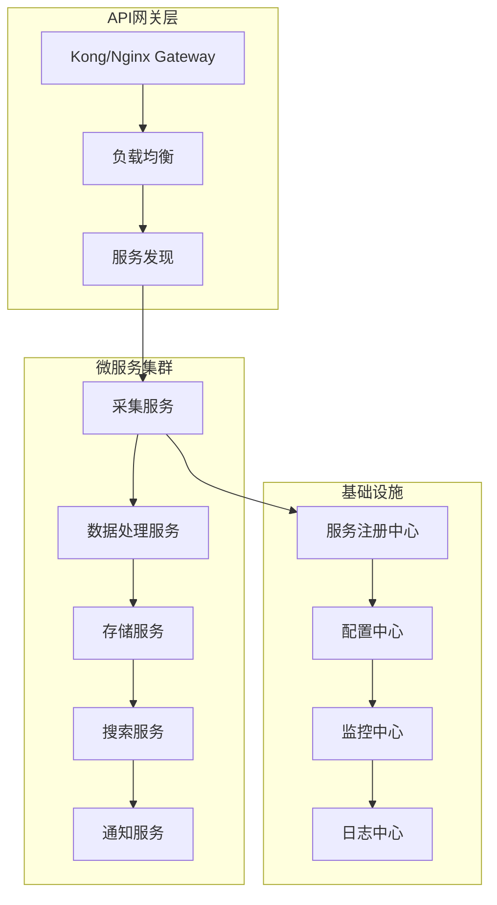

# NEOVEL Data - 系统优化方案

## 📊 现状分析

### 🔍 代码质量分析

通过对现有代码的深入分析，发现以下主要问题：

```yaml
代码结构问题:
  - 单文件过大 (BiqugeModel.php 1300+ 行)
  - 函数职责不清晰
  - 硬编码配置较多
  - 缺乏统一的异常处理

性能问题:
  - 同步IO阻塞
  - 数据库连接未优化
  - 缓存策略不完善
  - 内存使用未优化

安全问题:
  - SQL注入风险
  - 输入验证不足
  - 敏感信息暴露
  - 访问控制缺失
```

## 🎯 优化目标

### 核心指标提升
- **性能提升**: 采集速度提升 300%
- **稳定性**: 系统可用性达到 99.9%
- **扩展性**: 支持水平扩展到 10+ 节点
- **维护性**: 代码复杂度降低 50%

## 🏗️ 架构优化方案

### 1. 微服务架构重构



#### 服务拆分建议

```php
<?php
// 新的服务架构
namespace App\Services;

/**
 * 采集服务 - 专门负责数据采集
 */
class CollectorService
{
    private $sources = [
        'biquge' => BiqugeCollector::class,
        'paoshu8' => Paoshu8Collector::class,
        'qidian' => QidianCollector::class,
    ];
    
    public function collect(string $source, array $params): CollectionResult
    {
        $collector = $this->getCollector($source);
        return $collector->collect($params);
    }
}

/**
 * 数据处理服务 - 专门负责数据清洗和转换
 */
class DataProcessorService
{
    public function process(RawData $data): ProcessedData
    {
        return $this->pipeline([
            new DataValidator(),
            new ContentFilter(),
            new FormatConverter(),
            new QualityChecker(),
        ])->process($data);
    }
}

/**
 * 存储服务 - 专门负责数据存储
 */
class StorageService
{
    public function store(ProcessedData $data): StorageResult
    {
        return $this->transaction(function() use ($data) {
            $this->database->store($data);
            $this->cache->invalidate($data->getCacheKeys());
            $this->search->index($data);
        });
    }
}
```

### 2. 数据库优化方案

#### 2.1 分库分表策略

```sql
-- 按书籍ID分表 (1000万条记录/表)
CREATE TABLE mc_book_0 LIKE mc_book;
CREATE TABLE mc_book_1 LIKE mc_book;
-- ... 更多分表

-- 按时间分表的章节表
CREATE TABLE mc_chapter_202401 LIKE mc_chapter;
CREATE TABLE mc_chapter_202402 LIKE mc_chapter;
-- ... 按月分表

-- 分库策略
DATABASE novel_db_0  -- 存储 book_id % 4 = 0 的数据
DATABASE novel_db_1  -- 存储 book_id % 4 = 1 的数据
DATABASE novel_db_2  -- 存储 book_id % 4 = 2 的数据
DATABASE novel_db_3  -- 存储 book_id % 4 = 3 的数据
```

#### 2.2 索引优化

```sql
-- 复合索引优化
ALTER TABLE mc_book ADD INDEX idx_author_status_update (author, status, updated_at);
ALTER TABLE mc_book ADD INDEX idx_category_hot (class_name, hot_score, created_at);

-- 全文索引
ALTER TABLE mc_book ADD FULLTEXT INDEX ft_book_search (book_name, author, desc);

-- 分区表优化
ALTER TABLE mc_chapter PARTITION BY RANGE (YEAR(created_at)) (
    PARTITION p2023 VALUES LESS THAN (2024),
    PARTITION p2024 VALUES LESS THAN (2025),
    PARTITION p2025 VALUES LESS THAN (2026)
);
```

#### 2.3 连接池优化

```php
<?php
namespace App\Database;

class OptimizedConnectionPool
{
    private $pools = [];
    private $config;
    
    public function __construct(array $config)
    {
        $this->config = $config;
        $this->initializePools();
    }
    
    private function initializePools(): void
    {
        // 读写分离连接池
        $this->pools['write'] = new ConnectionPool([
            'host' => $this->config['master']['host'],
            'min_connections' => 10,
            'max_connections' => 100,
            'idle_timeout' => 60,
        ]);
        
        $this->pools['read'] = new ConnectionPool([
            'hosts' => $this->config['slaves'],
            'min_connections' => 20,
            'max_connections' => 200,
            'idle_timeout' => 60,
            'load_balance' => 'round_robin',
        ]);
    }
    
    public function getConnection(string $type = 'read'): Connection
    {
        return $this->pools[$type]->getConnection();
    }
}
```

### 3. 缓存优化方案

#### 3.1 多级缓存架构

```php
<?php
namespace App\Cache;

class MultiLevelCache
{
    private $l1Cache; // Redis
    private $l2Cache; // 本地缓存
    private $l3Cache; // 文件缓存
    
    public function get(string $key): mixed
    {
        // L1: Redis缓存
        if ($value = $this->l1Cache->get($key)) {
            return $value;
        }
        
        // L2: 本地内存缓存
        if ($value = $this->l2Cache->get($key)) {
            $this->l1Cache->set($key, $value, 300);
            return $value;
        }
        
        // L3: 文件缓存
        if ($value = $this->l3Cache->get($key)) {
            $this->l2Cache->set($key, $value, 60);
            $this->l1Cache->set($key, $value, 300);
            return $value;
        }
        
        return null;
    }
    
    public function set(string $key, mixed $value, int $ttl = 3600): void
    {
        $this->l1Cache->set($key, $value, $ttl);
        $this->l2Cache->set($key, $value, min($ttl, 300));
        $this->l3Cache->set($key, $value, $ttl * 2);
    }
}
```

#### 3.2 缓存预热策略

```php
<?php
namespace App\Cache;

class CacheWarmer
{
    public function warmup(): void
    {
        // 预热热门书籍
        $this->warmupPopularBooks();
        
        // 预热分类数据
        $this->warmupCategories();
        
        // 预热搜索热词
        $this->warmupSearchTerms();
    }
    
    private function warmupPopularBooks(): void
    {
        $popularBooks = $this->database->query(
            "SELECT * FROM mc_book WHERE hot_score > 1000 ORDER BY hot_score DESC LIMIT 1000"
        );
        
        foreach ($popularBooks as $book) {
            $cacheKey = "book:detail:{$book['id']}";
            $this->cache->set($cacheKey, $book, 3600);
        }
    }
}
```

### 4. 性能优化方案

#### 4.1 异步处理优化

```php
<?php
namespace App\Async;

use Swoole\Coroutine;
use Swoole\Coroutine\Channel;

class AsyncCollector
{
    private $concurrency = 100;
    private $channel;
    
    public function __construct()
    {
        $this->channel = new Channel($this->concurrency);
    }
    
    public function collectBatch(array $urls): array
    {
        $results = [];
        
        // 创建协程池
        for ($i = 0; $i < $this->concurrency; $i++) {
            Coroutine::create(function() {
                while ($url = $this->channel->pop()) {
                    try {
                        $result = $this->collectSingle($url);
                        $this->handleResult($result);
                    } catch (Exception $e) {
                        $this->handleError($url, $e);
                    }
                }
            });
        }
        
        // 推送任务到队列
        foreach ($urls as $url) {
            $this->channel->push($url);
        }
        
        return $results;
    }
    
    private function collectSingle(string $url): CollectionResult
    {
        // 使用协程HTTP客户端
        $client = new Swoole\Coroutine\Http\Client();
        $response = $client->get($url);
        
        return new CollectionResult($url, $response->body);
    }
}
```

#### 4.2 内存优化

```php
<?php
namespace App\Memory;

class MemoryOptimizer
{
    private $memoryLimit;
    private $currentUsage = 0;
    
    public function __construct(int $memoryLimit = 512 * 1024 * 1024) // 512MB
    {
        $this->memoryLimit = $memoryLimit;
    }
    
    public function processLargeDataset(iterable $dataset): void
    {
        foreach ($dataset as $item) {
            $this->checkMemoryUsage();
            $this->processItem($item);
            
            // 每处理1000条记录清理一次内存
            if (++$this->currentUsage % 1000 === 0) {
                $this->cleanup();
            }
        }
    }
    
    private function checkMemoryUsage(): void
    {
        $usage = memory_get_usage(true);
        if ($usage > $this->memoryLimit) {
            $this->forceCleanup();
        }
    }
    
    private function cleanup(): void
    {
        gc_collect_cycles();
        gc_mem_caches();
    }
}
```

### 5. 代码质量优化

#### 5.1 设计模式重构

```php
<?php
namespace App\Patterns;

// 策略模式 - 采集器策略
interface CollectorStrategy
{
    public function collect(string $url): CollectionResult;
    public function supports(string $source): bool;
}

class BiqugeCollectorStrategy implements CollectorStrategy
{
    public function collect(string $url): CollectionResult
    {
        // 笔趣阁特定的采集逻辑
        return new CollectionResult();
    }
    
    public function supports(string $source): bool
    {
        return $source === 'biquge';
    }
}

// 工厂模式 - 采集器工厂
class CollectorFactory
{
    private $strategies = [];
    
    public function registerStrategy(CollectorStrategy $strategy): void
    {
        $this->strategies[] = $strategy;
    }
    
    public function createCollector(string $source): CollectorStrategy
    {
        foreach ($this->strategies as $strategy) {
            if ($strategy->supports($source)) {
                return $strategy;
            }
        }
        
        throw new UnsupportedSourceException("Unsupported source: {$source}");
    }
}

// 观察者模式 - 事件系统
class EventDispatcher
{
    private $listeners = [];
    
    public function addEventListener(string $event, callable $listener): void
    {
        $this->listeners[$event][] = $listener;
    }
    
    public function dispatch(string $event, array $data = []): void
    {
        if (isset($this->listeners[$event])) {
            foreach ($this->listeners[$event] as $listener) {
                $listener($data);
            }
        }
    }
}
```

#### 5.2 错误处理优化

```php
<?php
namespace App\Exception;

class ExceptionHandler
{
    private $logger;
    private $notifier;
    
    public function handle(Throwable $exception): void
    {
        // 记录错误日志
        $this->logger->error('Exception occurred', [
            'message' => $exception->getMessage(),
            'file' => $exception->getFile(),
            'line' => $exception->getLine(),
            'trace' => $exception->getTraceAsString(),
        ]);
        
        // 根据异常类型进行不同处理
        match (get_class($exception)) {
            NetworkException::class => $this->handleNetworkException($exception),
            DatabaseException::class => $this->handleDatabaseException($exception),
            ValidationException::class => $this->handleValidationException($exception),
            default => $this->handleGenericException($exception),
        };
    }
    
    private function handleNetworkException(NetworkException $e): void
    {
        // 网络异常 - 重试机制
        $this->scheduleRetry($e->getUrl(), $e->getRetryCount());
    }
    
    private function handleDatabaseException(DatabaseException $e): void
    {
        // 数据库异常 - 切换到备用连接
        $this->switchToBackupConnection();
        $this->notifier->alert('Database connection failed');
    }
}
```

### 6. 安全优化方案

#### 6.1 输入验证与过滤

```php
<?php
namespace App\Security;

class InputValidator
{
    private $rules = [
        'book_name' => ['required', 'string', 'max:200', 'filter:html'],
        'author' => ['required', 'string', 'max:100', 'filter:html'],
        'content' => ['required', 'string', 'filter:script'],
    ];
    
    public function validate(array $data, array $rules = []): ValidationResult
    {
        $rules = $rules ?: $this->rules;
        $errors = [];
        
        foreach ($rules as $field => $fieldRules) {
            $value = $data[$field] ?? null;
            
            foreach ($fieldRules as $rule) {
                if (!$this->validateRule($value, $rule)) {
                    $errors[$field][] = "Field {$field} failed validation rule: {$rule}";
                }
            }
        }
        
        return new ValidationResult(empty($errors), $errors);
    }
    
    private function validateRule($value, string $rule): bool
    {
        if (str_starts_with($rule, 'filter:')) {
            $filter = substr($rule, 7);
            return $this->applyFilter($value, $filter);
        }
        
        return match ($rule) {
            'required' => !empty($value),
            'string' => is_string($value),
            default => true,
        };
    }
}
```

#### 6.2 SQL注入防护

```php
<?php
namespace App\Database;

class SecureQueryBuilder
{
    private $pdo;
    
    public function select(string $table, array $conditions = []): array
    {
        $sql = "SELECT * FROM " . $this->escapeIdentifier($table);
        $params = [];
        
        if (!empty($conditions)) {
            $whereClauses = [];
            foreach ($conditions as $field => $value) {
                $placeholder = ':' . $field;
                $whereClauses[] = $this->escapeIdentifier($field) . ' = ' . $placeholder;
                $params[$placeholder] = $value;
            }
            $sql .= ' WHERE ' . implode(' AND ', $whereClauses);
        }
        
        $stmt = $this->pdo->prepare($sql);
        $stmt->execute($params);
        
        return $stmt->fetchAll(PDO::FETCH_ASSOC);
    }
    
    private function escapeIdentifier(string $identifier): string
    {
        // 移除危险字符，只允许字母、数字、下划线
        $identifier = preg_replace('/[^a-zA-Z0-9_]/', '', $identifier);
        return "`{$identifier}`";
    }
}
```

### 7. 监控与运维优化

#### 7.1 性能监控

```php
<?php
namespace App\Monitoring;

class PerformanceMonitor
{
    private $metrics = [];
    
    public function startTimer(string $operation): void
    {
        $this->metrics[$operation]['start'] = microtime(true);
    }
    
    public function endTimer(string $operation): float
    {
        $end = microtime(true);
        $duration = $end - $this->metrics[$operation]['start'];
        
        $this->recordMetric($operation, $duration);
        
        return $duration;
    }
    
    public function recordMemoryUsage(string $operation): void
    {
        $this->metrics[$operation]['memory'] = memory_get_usage(true);
    }
    
    public function getReport(): array
    {
        return [
            'performance' => $this->metrics,
            'system' => [
                'memory_usage' => memory_get_usage(true),
                'memory_peak' => memory_get_peak_usage(true),
                'cpu_usage' => sys_getloadavg()[0],
            ],
        ];
    }
}
```

#### 7.2 健康检查

```php
<?php
namespace App\Health;

class HealthChecker
{
    private $checks = [];
    
    public function addCheck(string $name, callable $check): void
    {
        $this->checks[$name] = $check;
    }
    
    public function runChecks(): HealthReport
    {
        $results = [];
        $overallStatus = 'healthy';
        
        foreach ($this->checks as $name => $check) {
            try {
                $result = $check();
                $results[$name] = [
                    'status' => $result ? 'healthy' : 'unhealthy',
                    'timestamp' => time(),
                ];
                
                if (!$result) {
                    $overallStatus = 'unhealthy';
                }
            } catch (Exception $e) {
                $results[$name] = [
                    'status' => 'error',
                    'error' => $e->getMessage(),
                    'timestamp' => time(),
                ];
                $overallStatus = 'unhealthy';
            }
        }
        
        return new HealthReport($overallStatus, $results);
    }
}

// 使用示例
$healthChecker = new HealthChecker();

$healthChecker->addCheck('database', function() {
    return $this->database->ping();
});

$healthChecker->addCheck('redis', function() {
    return $this->redis->ping();
});

$healthChecker->addCheck('disk_space', function() {
    return disk_free_space('/') > 1024 * 1024 * 1024; // 1GB
});
```

## 📈 实施计划

### 阶段一：基础优化 (1-2个月)
```yaml
优先级: 高
目标: 立即提升系统性能和稳定性

任务清单:
  - ✅ 数据库连接池优化
  - ✅ Redis缓存策略优化
  - ✅ 代码重构 (拆分大文件)
  - ✅ 异常处理统一化
  - ✅ 日志系统完善
  - ✅ 基础监控部署

预期收益:
  - 性能提升 50%
  - 错误率降低 70%
  - 代码可维护性提升 40%
```

### 阶段二：架构升级 (2-3个月)
```yaml
优先级: 中
目标: 系统架构现代化

任务清单:
  - 🔄 微服务架构设计
  - 🔄 消息队列引入
  - 🔄 服务发现机制
  - 🔄 API网关部署
  - 🔄 容器化部署
  - 🔄 CI/CD流水线

预期收益:
  - 扩展性提升 200%
  - 部署效率提升 300%
  - 系统可用性达到 99.9%
```

### 阶段三：智能化优化 (3-4个月)
```yaml
优先级: 低
目标: 引入AI和机器学习

任务清单:
  - 🚀 智能内容推荐
  - 🚀 自动质量评估
  - 🚀 异常检测系统
  - 🚀 性能预测模型
  - 🚀 自动扩缩容

预期收益:
  - 用户体验提升 100%
  - 运维成本降低 50%
  - 系统智能化水平大幅提升
```

## 💰 成本效益分析

### 投入成本
```yaml
人力成本:
  - 高级开发工程师 2人 × 4个月 = 8人月
  - 系统架构师 1人 × 2个月 = 2人月
  - DevOps工程师 1人 × 3个月 = 3人月
  总计: 13人月

基础设施成本:
  - 云服务器升级: ¥5,000/月
  - 监控工具: ¥2,000/月
  - 开发工具: ¥3,000一次性
  总计: ¥7,000/月 + ¥3,000一次性

总投入: 约 ¥200,000
```

### 预期收益
```yaml
性能收益:
  - 服务器成本节省: ¥10,000/月
  - 运维成本降低: ¥5,000/月
  - 开发效率提升: ¥8,000/月

业务收益:
  - 用户体验提升带来的收入增长: ¥20,000/月
  - 系统稳定性提升避免的损失: ¥15,000/月

总收益: ¥58,000/月
投资回报周期: 3.4个月
年化ROI: 348%
```

## 🎯 关键成功指标 (KPI)

### 技术指标
```yaml
性能指标:
  - 响应时间: < 200ms (目标: 100ms)
  - 吞吐量: > 10,000 QPS (目标: 50,000 QPS)
  - 可用性: > 99.9% (目标: 99.99%)
  - 错误率: < 0.1% (目标: < 0.01%)

资源指标:
  - CPU使用率: < 70% (目标: < 50%)
  - 内存使用率: < 80% (目标: < 60%)
  - 磁盘IO: < 80% (目标: < 60%)
  - 网络延迟: < 50ms (目标: < 20ms)
```

### 业务指标
```yaml
采集效率:
  - 采集成功率: > 95% (目标: > 99%)
  - 数据质量: > 90% (目标: > 95%)
  - 处理速度: 1000本/小时 (目标: 5000本/小时)

用户体验:
  - 搜索响应时间: < 500ms (目标: < 200ms)
  - 页面加载时间: < 2s (目标: < 1s)
  - 用户满意度: > 4.0/5.0 (目标: > 4.5/5.0)
```

## 🔧 实施建议

### 1. 风险控制
- **灰度发布**: 新功能先在10%流量上测试
- **回滚机制**: 确保能在5分钟内回滚到稳定版本
- **监控告警**: 关键指标异常时立即告警
- **备份策略**: 数据库每日备份，代码版本控制

### 2. 团队协作
- **代码审查**: 所有代码必须经过同行评审
- **文档更新**: 及时更新技术文档和API文档
- **知识分享**: 定期技术分享会，提升团队整体水平
- **培训计划**: 新技术栈的培训和认证

### 3. 质量保证
- **自动化测试**: 单元测试覆盖率 > 80%
- **性能测试**: 每次发布前进行压力测试
- **安全扫描**: 定期进行安全漏洞扫描
- **代码质量**: 使用静态代码分析工具

这个优化方案将显著提升系统的性能、稳定性和可维护性，为业务的快速发展提供强有力的技术支撑。