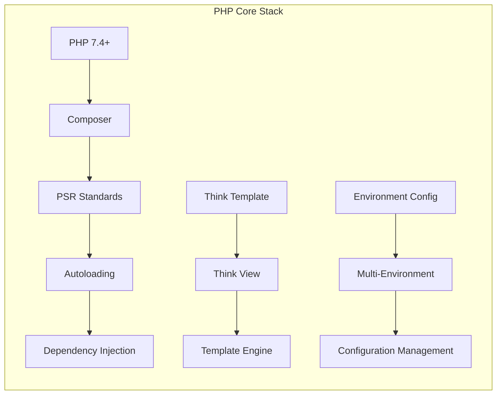
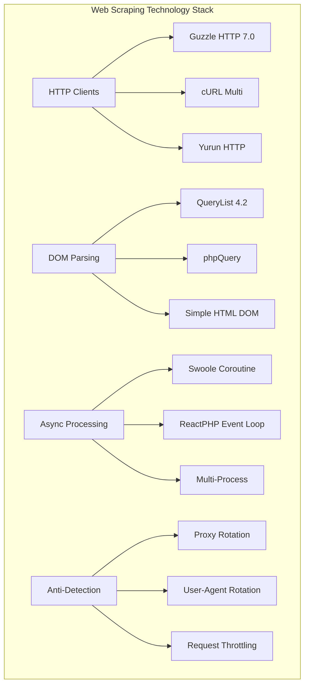
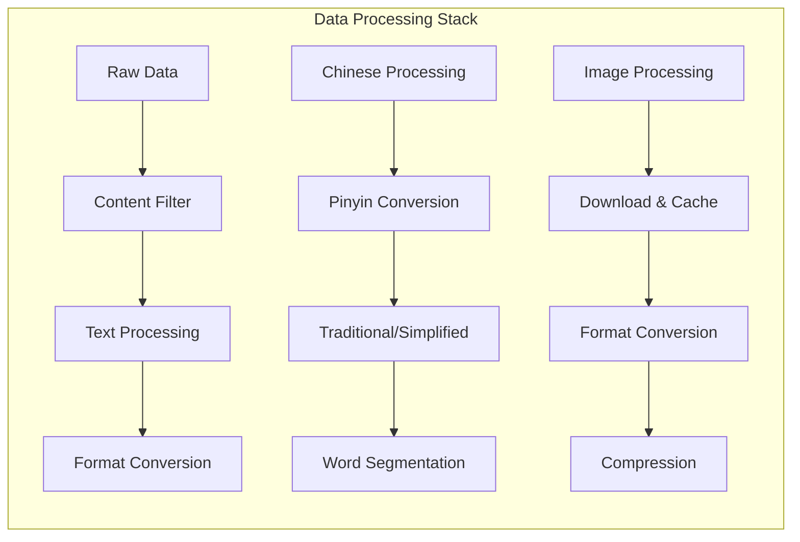
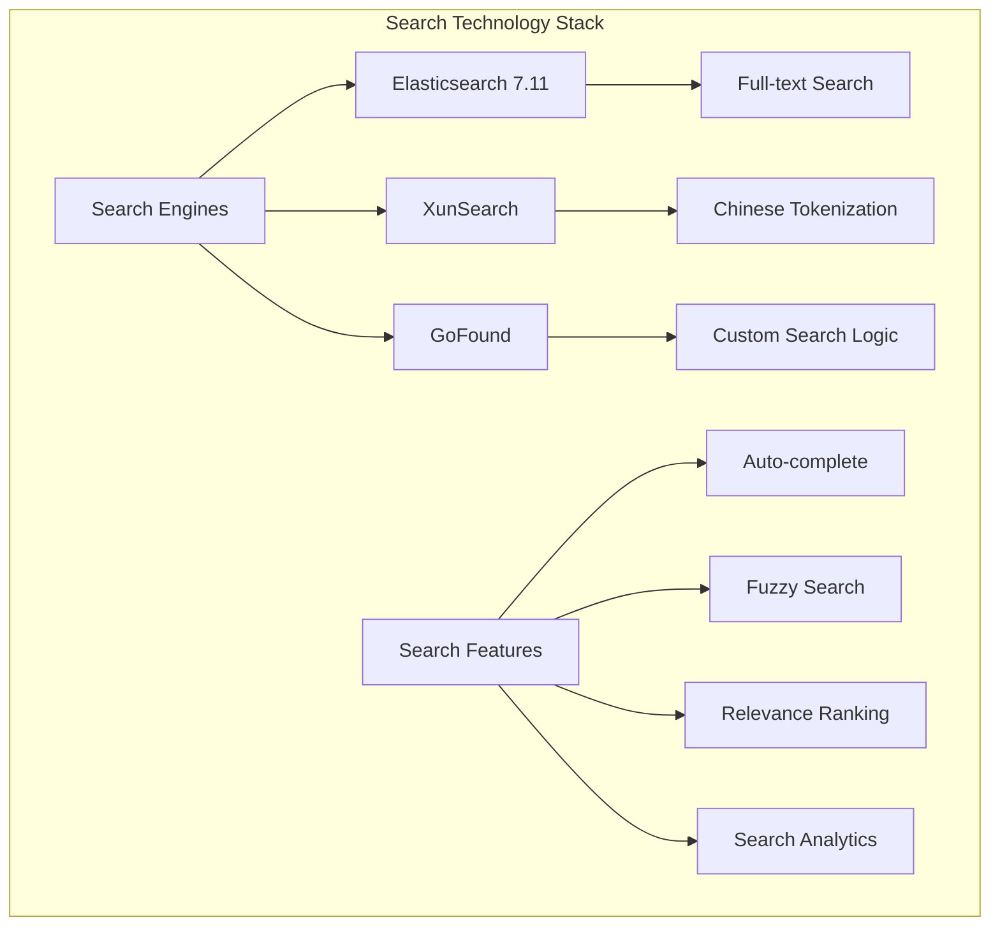
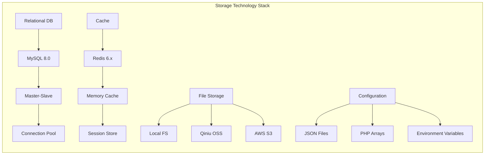
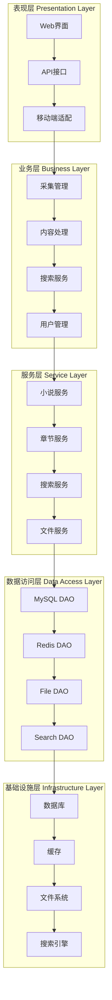
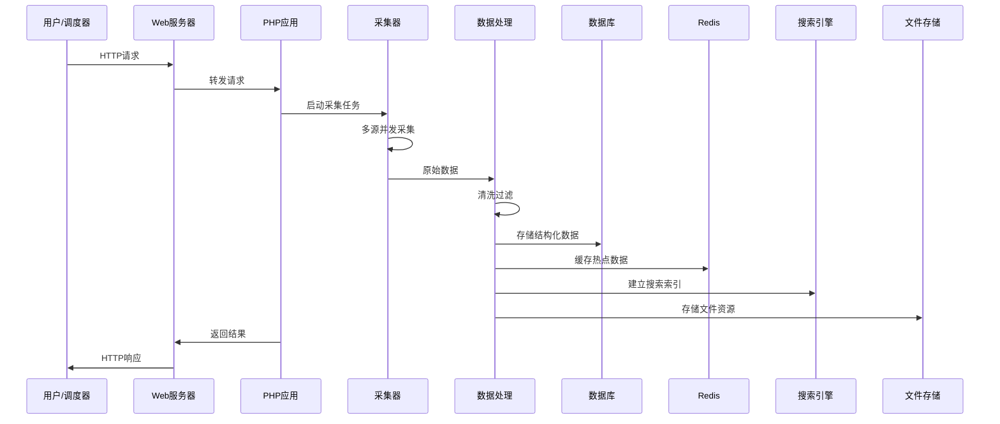
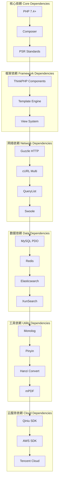

# 🏗️ NEOVEL Data 技术栈架构图

## 📊 完整技术栈架构图

```mermaid
graph TB
    subgraph "🌐 前端展示层 Frontend Presentation Layer"
        FE1[HTML5/CSS3] --> FE2[JavaScript ES6+]
        FE2 --> FE3[jQuery 3.x]
        FE3 --> FE4[AJAX文件上传]
        FE4 --> FE5[图片区域选择]
        FE5 --> FE6[响应式设计]
    end

    subgraph "🔧 Web服务层 Web Server Layer"
        WS1[Nginx 1.18+] --> WS2[PHP-FPM 7.4+]
        WS2 --> WS3[负载均衡]
        WS3 --> WS4[SSL/TLS]
        WS4 --> WS5[Gzip压缩]
    end

    subgraph "💻 PHP应用层 PHP Application Layer"
        PHP1[PHP 7.4+] --> PHP2[Composer 2.x]
        PHP2 --> PHP3[PSR-4 自动加载]
        PHP3 --> PHP4[MVC架构模式]
        PHP4 --> PHP5[依赖注入]
        PHP5 --> PHP6[中间件系统]
    end

    subgraph "🔍 网络爬虫层 Web Scraping Layer"
        SC1[Guzzle HTTP 7.0] --> SC2[cURL Multi]
        SC2 --> SC3[Swoole 协程]
        SC3 --> SC4[QueryList DOM解析]
        SC4 --> SC5[代理IP轮换]
        SC5 --> SC6[反爬虫策略]
    end

    subgraph "📚 业务逻辑层 Business Logic Layer"
        BL1[小说采集服务] --> BL2[多源数据整合]
        BL2 --> BL3[内容过滤清洗]
        BL3 --> BL4[章节解析处理]
        BL4 --> BL5[图片下载处理]
        BL5 --> BL6[数据格式转换]
    end

    subgraph "🗄️ 数据存储层 Data Storage Layer"
        DS1[MySQL 8.0] --> DS2[主从复制]
        DS2 --> DS3[分库分表]
        DS3 --> DS4[连接池管理]
        DS4 --> DS5[事务管理]
    end

    subgraph "⚡ 缓存层 Cache Layer"
        CA1[Redis 6.x] --> CA2[内存缓存]
        CA2 --> CA3[会话存储]
        CA3 --> CA4[队列缓存]
        CA4 --> CA5[分布式锁]
    end

    subgraph "🔍 搜索引擎层 Search Engine Layer"
        SE1[Elasticsearch 7.11] --> SE2[全文搜索]
        SE2 --> SE3[XunSearch 中文搜索]
        SE3 --> SE4[GoFound 自建搜索]
        SE4 --> SE5[搜索建议]
        SE5 --> SE6[相关性排序]
    end

    subgraph "📁 文件存储层 File Storage Layer"
        FS1[本地文件系统] --> FS2[七牛云存储]
        FS2 --> FS3[AWS S3]
        FS3 --> FS4[CDN加速]
        FS4 --> FS5[图片压缩]
    end

    subgraph "📱 第三方服务层 Third-party Services"
        TS1[腾讯云SMS] --> TS2[微信支付]
        TS2 --> TS3[支付宝支付]
        TS3 --> TS4[邮件服务]
        TS4 --> TS5[短信验证]
    end

    subgraph "📊 监控日志层 Monitoring & Logging"
        ML1[Monolog日志] --> ML2[错误监控]
        ML2 --> ML3[性能监控]
        ML3 --> ML4[业务监控]
        ML4 --> ML5[告警系统]
    end

    FE6 --> WS1
    WS5 --> PHP1
    PHP6 --> SC1
    SC6 --> BL1
    BL6 --> DS1
    DS5 --> CA1
    CA5 --> SE1
    SE6 --> FS1
    FS5 --> TS1
    TS5 --> ML1
```

## 🔧 核心技术组件详解

### 1. PHP核心框架栈

### 2. 数据采集技术栈

### 3. 数据处理技术栈

### 4. 搜索技术栈

### 5. 存储技术栈

## 🏗️ 系统架构分层图

## 🔄 数据流向图

## 📦 依赖关系图

## 🚀 部署架构图

```mermaid
graph TB
    subgraph "负载均衡层 Load Balancer"
        LB[Nginx Load Balancer]
    end
    
    subgraph "Web服务器集群 Web Server Cluster"
        WS1[Nginx + PHP-FPM 1]
        WS2[Nginx + PHP-FPM 2]
        WS3[Nginx + PHP-FPM 3]
    end
    
    subgraph "应用服务器集群 Application Server Cluster"
        AS1[PHP Application 1]
        AS2[PHP Application 2]
        AS3[PHP Application 3]
    end
    
    subgraph "数据库集群 Database Cluster"
        DB1[MySQL Master]
        DB2[MySQL Slave 1]
        DB3[MySQL Slave 2]
    end
    
    subgraph "缓存集群 Cache Cluster"
        RC1[Redis Master]
        RC2[Redis Slave]
        RC3[Redis Sentinel]
    end
    
    subgraph "搜索集群 Search Cluster"
        ES1[Elasticsearch Node 1]
        ES2[Elasticsearch Node 2]
        ES3[Elasticsearch Node 3]
    end
    
    subgraph "存储服务 Storage Services"
        ST1[Local File System]
        ST2[Qiniu Object Storage]
        ST3[AWS S3]
        ST4[CDN]
    end
    
    subgraph "监控服务 Monitoring Services"
        MN1[Application Monitoring]
        MN2[System Monitoring]
        MN3[Log Aggregation]
        MN4[Alert System]
    end
    
    LB --> WS1
    LB --> WS2
    LB --> WS3
    
    WS1 --> AS1
    WS2 --> AS2
    WS3 --> AS3
    
    AS1 --> DB1
    AS2 --> DB2
    AS3 --> DB3
    
    AS1 --> RC1
    AS2 --> RC1
    AS3 --> RC1
    
    AS1 --> ES1
    AS2 --> ES2
    AS3 --> ES3
    
    AS1 --> ST1
    AS2 --> ST2
    AS3 --> ST3
    
    AS1 --> MN1
    AS2 --> MN2
    AS3 --> MN3
```

这个技术栈架构图全面展示了NEOVEL Data小说采集系统的完整技术架构，包括前端、后端、数据库、缓存、搜索、存储等各个层面的技术选型和架构设计。